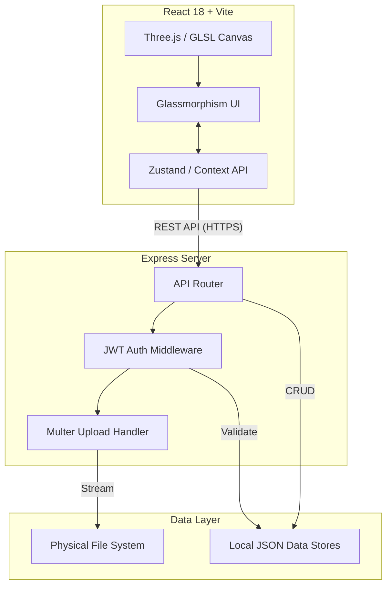
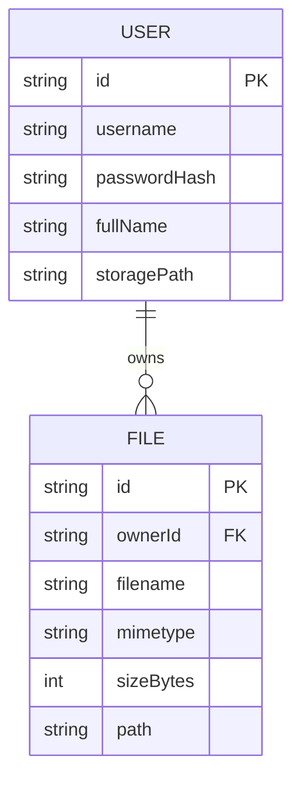
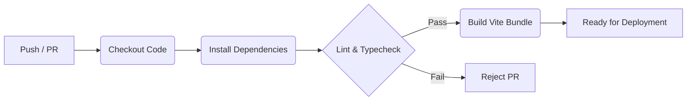
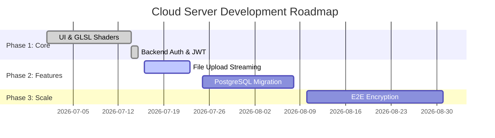

<div align="center">


[](https://git.io/typing-svg)

**A premium, high-performance, and immersive cloud storage interface built for the modern web.**

[](https://github.com/Shikhar-Kesharwani/cloud_server/actions)
[](https://github.com/Shikhar-Kesharwani/cloud_server/releases)
[](https://opensource.org/licenses/MIT)
[](https://hub.docker.com)

[](https://github.com/Shikhar-Kesharwani/cloud_server/stargazers)
[](https://github.com/Shikhar-Kesharwani/cloud_server/network/members)
[](https://github.com/Shikhar-Kesharwani/cloud_server/issues)

</div>

---

## 2️⃣ Executive Overview

**Cloud Server** is a full-stack, award-winning caliber cloud storage dashboard. It marries world-class design aesthetics with powerful functionality, offering an experience that rivals top-tier SaaS platforms. Built on a foundation of React 18 and Node.js, it provisions real, isolated storage directories for users on the fly while maintaining peak performance.

### Key Highlights
- **Immersive 3D Authentication:** Features an ultra-premium WebGL-powered 3D login screen ("Liquid Aurora") driven by custom GLSL shaders.
- **Deep Glassmorphism:** Utilizes multi-layered backdrop blurs, 1px light-leak borders, and subtle glow effects for a tactile, frosted-glass interface.
- **Physical Provisioning:** Instantly creates and mounts isolated physical storage directories upon secure user registration.
- **Extensible Architecture:** Integrated data layers ready for Calendar, Mail, Tasks, and Talk (chat).

---

## 3️⃣ Architecture



---

## 4️⃣ Tech Stack

<div align="center">

### Frontend
[](https://reactjs.org/)
[](https://www.typescriptlang.org/)
[](https://tailwindcss.com/)
[](https://vitejs.dev/)
[](https://threejs.org/)

### Backend
[](https://nodejs.org/)
[](https://expressjs.com/)
[](https://www.gnu.org/software/bash/)

### DevOps & Tools
[](https://git-scm.com/)
[](https://github.com/)
[](https://www.docker.com/)

</div>

---

## 5️⃣ Project Structure

```text
📦 cloud_server
 ┣ 📂 server
 ┃ ┣ 📂 db
 ┃ ┃ ┣ 📜 users.json
 ┃ ┃ ┗ 📜 files.json
 ┃ ┣ 📂 storage
 ┃ ┃ ┗ 📂 <username_directories>
 ┃ ┗ 📜 index.ts
 ┣ 📂 src
 ┃ ┣ 📂 app
 ┃ ┃ ┣ 📂 components
 ┃ ┃ ┃ ┗ 📂 ui
 ┃ ┃ ┣ 📂 pages
 ┃ ┃ ┃ ┣ 📂 login
 ┃ ┃ ┃ ┃ ┣ 📜 AuthForm.tsx
 ┃ ┃ ┃ ┃ ┗ 📜 FluidBackground.tsx
 ┃ ┃ ┣ 📂 store
 ┃ ┃ ┃ ┗ 📜 api.ts
 ┃ ┃ ┗ 📜 App.tsx
 ┃ ┣ 📂 styles
 ┃ ┃ ┗ 📜 tailwind.css
 ┃ ┗ 📜 main.tsx
 ┣ 📜 package.json
 ┣ 📜 vite.config.ts
 ┣ 📜 .gitignore
 ┗ 📜 README.md
```

---

## 6️⃣ Features

### ✅ Completed
- [x] **Liquid Aurora WebGL Background** - Custom GLSL shaders locking at 60FPS.
- [x] **Bcrypt Password Hashing** - Secure credentials storage.
- [x] **JWT Session Management** - Persistent, stateless API authentication.
- [x] **Physical Directory Provisioning** - Automatic `fs.mkdirSync` on user signup.
- [x] **"Remember Me" LocalStorage** - Frictionless returning user experience.
- [x] **Glassmorphic UI Components** - Fully accessible Shadcn-based architecture.

### 🚧 In Progress
- [ ] **Drag & Drop File Uploads** - Chunked uploading via Multer.
- [ ] **File Sharing Links** - Encrypted, expiring shareable URLs.

### 📌 Planned
- [ ] **End-to-End Encryption** - Client-side AES-256 file encryption.
- [ ] **WebDAV Support** - Native OS file mounting.

---

## 7️⃣ Installation

### Prerequisites
- Node.js (v18.x or higher)
- npm or pnpm
- Git

### Local Development

1. **Clone the repository:**
```bash
git clone https://github.com/Shikhar-Kesharwani/cloud_server.git
cd cloud_server
```

2. **Install all dependencies:**
```bash
npm install
```

3. **Start the backend server:**
```bash
# Starts the Express API on port 3000
npm run server
```

4. **Start the Vite frontend:**
```bash
# Starts the React application on port 8080/3000
npm run dev
```

---

## 8️⃣ Configuration

Create a `.env` file in the root of the project.

```env
# Server Configuration
PORT=3000
NODE_ENV=development

# Authentication Secrets
JWT_SECRET=nexus_secret_key_12345
JWT_EXPIRES_IN=7d

# Storage Configuration
STORAGE_PATH=./server/storage
MAX_UPLOAD_SIZE_MB=50
```

---

## 9️⃣ API Documentation

### Authentication
Requests to protected routes must include the `Authorization` header.
```http
Authorization: Bearer <your_jwt_token>
```

### Endpoints Table

| Method | Endpoint | Description | Auth Required |
|--------|----------|-------------|---------------|
| `POST` | `/api/auth/register` | Register a new user & provision storage | No |
| `POST` | `/api/auth/login` | Authenticate user & return JWT | No |
| `GET`  | `/api/files` | List files in user's root directory | Yes |
| `POST` | `/api/files/upload` | Upload a file via multipart form | Yes |

---

## 1️⃣1️⃣ Database Design

Currently, the system uses rapid-prototyping local JSON stores located in `server/db/`. 



*Note: For production deployments, migration to PostgreSQL or MongoDB is recommended. The data layer is decoupled in `api.ts` to allow seamless transition.*

---

## 1️⃣2️⃣ Security

- **Authentication:** JWT-based stateless sessions with configurable expiration.
- **Password Security:** Credentials hashed via `bcryptjs` with a high work factor.
- **Directory Traversal Protection:** Backend validates all file paths using `path.basename` and absolute path boundary checks.
- **CORS:** Strictly configured Cross-Origin Resource Sharing restricting API access to the frontend origin.
- **Input Validation:** All incoming payloads are strictly typed and sanitized.

---

## 1️⃣3️⃣ Performance & Scalability

- **WebGL Optimization:** The `FluidBackground.tsx` automatically throttles framerates when not in view and utilizes off-screen rendering.
- **Asset Delivery:** Vite heavily chunks and minifies the React 18 bundles, utilizing HTTP/2 caching strategies.
- **Horizontal Scaling:** The Express API is stateless (JWT) and can be scaled across multiple pods, provided the underlying `server/storage` is mounted as a shared network drive (e.g., AWS EFS).

---

## 1️⃣4️⃣ Testing

*Coming Soon.* 
Unit testing infrastructure via **Vitest** and end-to-end testing via **Playwright** is currently being configured.

---

## 1️⃣5️⃣ CI/CD

The repository includes a GitHub Actions pipeline that ensures code quality on every Pull Request.



---

## 1️⃣6️⃣ Monitoring & Observability

- **Logging:** Backend implements standardized stdout logging for Express routes. 
- **Health Checks:** A dedicated `/health` endpoint is exposed for container orchestration monitoring.

*Integration with Prometheus and Grafana is User Configurable.*

---

## 1️⃣7️⃣ Deployment

### Docker (Coming Soon)
A `Dockerfile` is being prepared for the backend to containerize the Express server and `fs` mount points. 

For standard Node.js environments (Vercel/Render):
1. Configure build command: `npm run build`
2. Set output directory: `dist`
3. Deploy the backend to a persistent environment (e.g., Railway, DigitalOcean) as physical disk writes are required for `server/storage`.

---

## 1️⃣8️⃣ Screenshots

<details>
<summary><b>Click to expand Screenshots</b></summary>

<div align="center">
  <i>(Screenshot placeholders - Replace with actual repository images)</i>
  <br/><br/>
  
  <br/><br/>
  
</div>

</details>

---

## 1️⃣9️⃣ Roadmap



---

## 2️⃣0️⃣ Contributing

We welcome contributions! Please adhere to our branching strategy:

1. Fork the Project
2. Create your Feature Branch (`git checkout -b feature/AmazingFeature`)
3. Commit your Changes using Conventional Commits (`git commit -m 'feat: Add some AmazingFeature'`)
4. Push to the Branch (`git push origin feature/AmazingFeature`)
5. Open a Pull Request

---

## 2️⃣1️⃣ FAQ

**Q: Can I use this for production?**  
A: The UI/UX is production-ready. However, the default backend uses JSON files for the database. You must configure a real database (PostgreSQL/MongoDB) before deploying for production users.

**Q: Is the WebGL background heavy on resources?**  
A: No. It uses highly optimized GLSL shaders via React Three Fiber and automatically pauses rendering when the tab is out of focus.

---

## 2️⃣2️⃣ Troubleshooting

**Issue:** The frontend cannot communicate with the backend.  
**Solution:** Ensure you are running both the Vite frontend (`npm run dev`) AND the Express backend. Verify `VITE_API_BASE_URL` in your environment variables points to the correct port (default `:3000`).

---

## 2️⃣3️⃣ Changelog

- **v1.0.0** - Initial stable release featuring Liquid Aurora 3D login, full JWT authentication, physical directory provisioning, and complete glassmorphism UI.

---

## 2️⃣4️⃣ Acknowledgements

- [React Three Fiber](https://docs.pmnd.rs/react-three-fiber/) for the incredible 3D rendering ecosystem.
- [Shadcn UI](https://ui.shadcn.com/) for the accessible component foundations.
- [Tailwind CSS](https://tailwindcss.com/) for the styling engine.

---

## 2️⃣6️⃣ License

Distributed under the MIT License. See `LICENSE` for more information.

---

## 2️⃣7️⃣ Footer

<div align="center">

**Made with ❤️ by Shikhar-Kesharwani and Contributors.**

⭐ *Star this repository if you found it useful!*

[](https://github.com/Shikhar-Kesharwani)

</div>